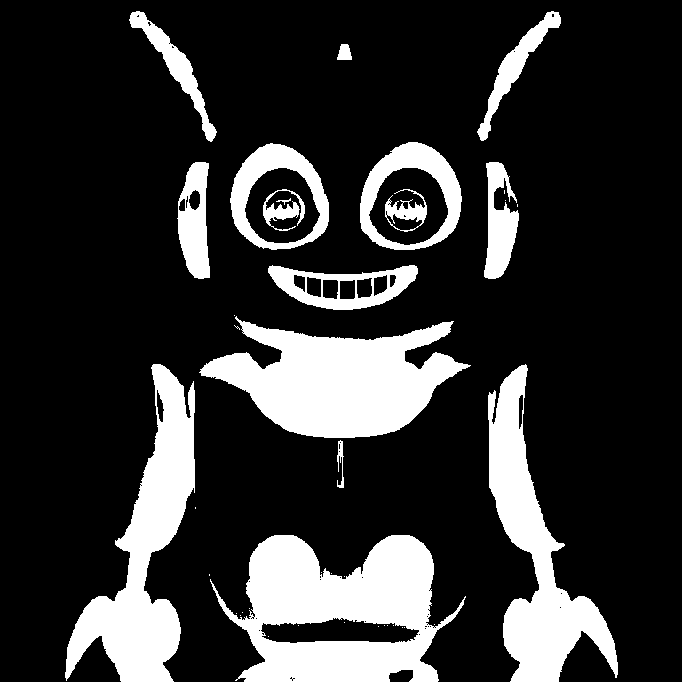
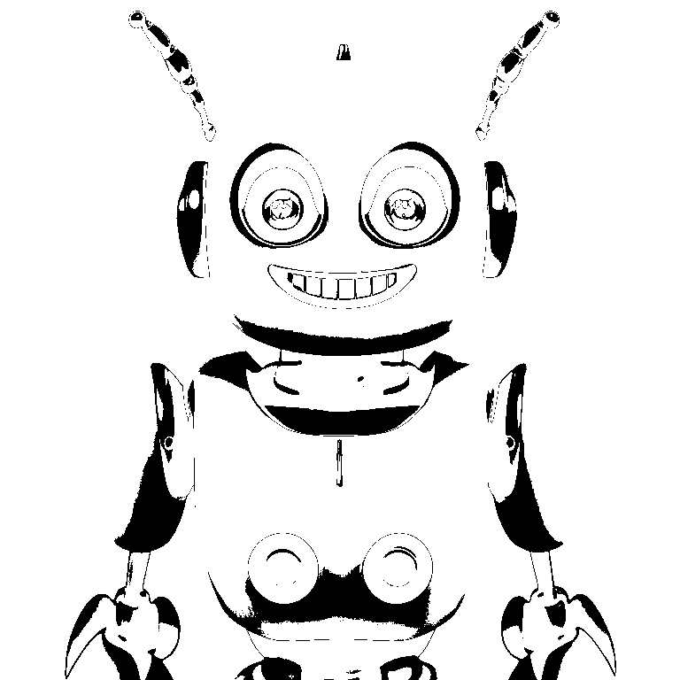

# thresholding-node
The thresholding node takes in a source image and outputs three mask images representing the portions of the source
that are highlights, midtones, and shadows, per the brightness values (0-255) that you set.

Example input:

Highlights output:

Midtones output:

Shadows output:

This node also can blur the lookup table that it uses to separate the three brightness regions, resulting in a smoother mask. Note that this is not the same as blurring the masks themselves.

Highlights output w/LUT blur:

Midtones output w/LUT blur:

Shadows output w/LUT blur:

